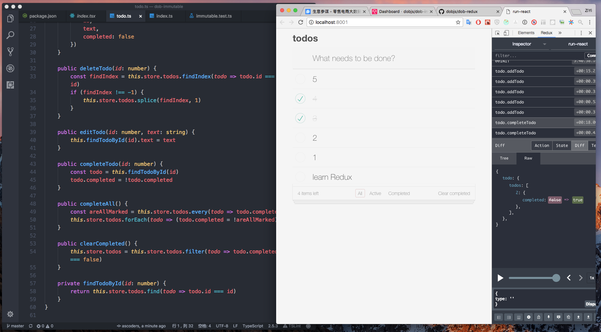

# Dob-redux &middot; [](https://travis-ci.org/dobjs/dob-redux) [](https://www.npmjs.com/package/dob-redux) [](https://codecov.io/github/dobjs/dob-redux)



## Usage

```typescript
import { observable, createReduxStore } from 'dob'
import { Provider, connect } from "react-redux"

class User {
  store = observable({
    name: "nick",
    age: 5,
    articles: [{
      title: "book1",
      price: 59
    }, {
      title: "book2",
      price: 63
    }]
  })

  setName(name) {
    this.store.name = name
  }

  addArticle(article) {
    this.store.articles.push(article)
  }
}

const { store, actions } = createReduxStore({
  user: User
})

@connect((state, ownProps) => {
  return {
    name: state.user.name,
    articles: state.user.articles
  }
})
class App extends React.PureComponent {
  componentWillMount() {
    actions.user.addArticle({
      	title: "book3",
        price: 66
      })
  }

  render() {
    const Articles = this.props.articles.map((article, index) => {
      return (
        <div key={index}>{article.title}, {article.price}</div>
      )
    })

    return (
      <div>
        {this.props.name}
        {Articles}
      </div>
    )
  }
}

ReactDOM.render(
  <Provider store={store}>
    <App />
  </Provider>,
  document.getElementById("react-dom")
)
```